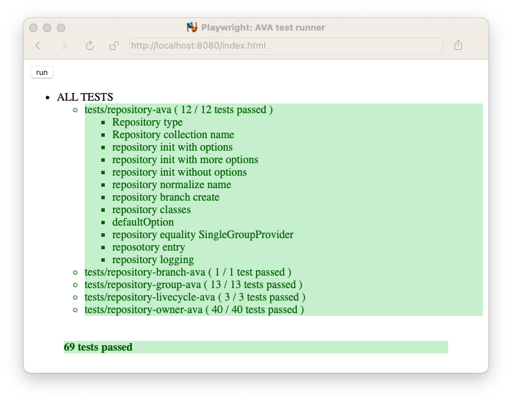

[](https://www.npmjs.com/package/browser-ava)
[](https://opensource.org/licenses/BSD-3-Clause)
[](https://bundlejs.com/?q=browser-ava)
[](https://npmjs.org/package/browser-ava)
[](https://github.com/arlac77/browser-ava/issues)
[](https://actions-badge.atrox.dev/arlac77/browser-ava/goto)
[](https://github.com/prettier/prettier)
[](http://commitizen.github.io/cz-cli/)
[](https://snyk.io/test/github/arlac77/browser-ava)
[](https://coveralls.io/github/arlac77/browser-ava)
# browser-ava
Run ava tests in the browser


## What it does

If your code does not depend on any node api (process, fs, ...) then this runner allows to run your ava test inside the browser.

### Running your tests

```console
browser-ava --webkit --chromium --firefox tests/*.mjs
```



## limitations

- only supports ESM


## install

```console
npm -g install browser-ava
```